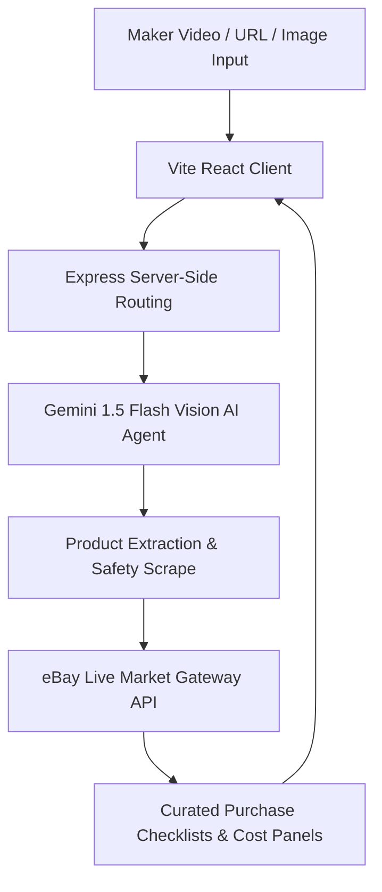

# 🛠️ Watch1Do1 — AI-Assisted Shopping for Makers

**Watch1Do1** is a high-end platform for builders, crafters, and DIY enthusiast makers. By combining high-definition video analysis with server-side AI, it parses how-to and tutorial content to instantly extract structured product kits, perform safety audits, estimate costs, and match raw ingredients to real-time purchase links on eBay. 

AI-powered analysis gets you started fast. Creator-verified kits and community contributions keep everything accurate and up-to-date, transforming Watch1Do1 into a complete community-powered workspace.

> **Live Demo:** [https://watch1-do1-beta.vercel.app](https://watch1-do1-beta.vercel.app)

---

## ⭐️ Key Features

### 🔍 1. Interactive Video & Tutorial Analysis
*   **Prompt-to-Product Extraction**: Put in any how-to video URL or text tutorial.
*   **Visual Frame Parsing**: Built-in vision processing powered by Gemini analyzes physical visual components, tool shapes, and raw materials.
*   **Structured Kit Assembly**: Converts dense visual footage into neat checklists categorized by *"Must-Haves"* vs. *"Optional Enhancements"*.

### 🛒 2. Direct Hub Integrations & Live Shopping
*   **Real-Time eBay Discovery**: Automatically queries live eBay market listings to find immediate, active purchase matches for every extracted tool, part, material, and accessory.
*   **One-Click Procurements**: Curate exact builder kits without having to scour dozens of different hardware stores.

### 🛡️ 3. Safety Sweeps & Risk Scoreboards
*   **Automated Risk Audit**: Flags high-temp operations, electric hazards, toxic compounds, dust, and particulate inhalation risks.
*   **Surgical Safety Tips**: Tells you exactly what personal protective equipment (PPE) is needed before you start building.

### 💸 4. Smart Cost Estimation
*   **Aggregated Pricing Pools**: Provides real-time budget estimates and aggregate kit valuations.
*   **Alternate Optioning**: Recommends budget vs. premium choices for both novice and master craftsmen.

### 👥 5. Community, Gamification & Premium Builders
*   **Maker Tiers**: Experience gamified leaderboards, unlock master builder badges, and coordinate team builds.
*   **Planning Kits & Blueprints**: Export sequence-guided step-by-step assembly guides with customized timeline tracking.

---

## 🏛️ System Architecture & Data Flow



---

## 💻 Tech Stack

Watch1Do1 is engineered with a modern, full-stack, type-safe architecture:

*   **Frontend UI:** React 19, Tailwind CSS, Lucide Icons, and smooth animations using Motion (`motion/react`).
*   **Development Server & Bundler:** Vite 6 with server capabilities.
*   **Backend Server:** Express 5 running Node 20.x with typescript compiler support.
*   **AI Engine:** Google Gen AI SDK (`@google/genai`) hosting cutting-edge Gemini models server-side to guarantee secure API credential safety.
*   **Database Integration:** MongoDB Driver for managing persistent portfolios, user states, and cached kit specifications.
*   **External Service Integrations:** Live eBay developer API proxies, Stripe payment processing configurations, and Resend notifications engines.

---

## 🚀 How to Get Started

### Prerequisites

*   Node.js (v20.x highly recommended)
*   npm or yarn
*   A Gemini API Key (set server-side in your environmental files)

### 1. Installation

Clone the repository and install all dependencies:

```bash
git clone https://github.com/Watch1Do1/Watch1Do1Beta.git
cd Watch1Do1Beta
npm install
```

### 2. Configuration

Create a `.env` file in the root directory and specify your secret keys:

```env
# Server-side Secrets (Will never be shipped to the client)
GEMINI_API_KEY=your_gemini_api_key_here
MONGODB_URI=your_mongodb_connection_uri
STRIPE_SECRET_KEY=your_stripe_secret_key
RESEND_API_KEY=your_resend_api_key
```

### 3. Launch Development Server

Start the local server configured to bind to port `3000`:

```bash
npm run dev
```

Open `http://localhost:3000` in your browser to experience the application.

---

## 🛡️ Vercel Deployment Configurations

Our deployment pipeline is secured via a strict server-side rewrites routine in `vercel.json`:

```json
{
  "version": 2,
  "rewrites": [
    { "source": "/api/(.*)", "destination": "/api/index.ts" },
    { "source": "/(.*)", "destination": "/index.html" }
  ]
}
```

---

## 📬 Contact & Socials

*   **Website:** [https://watch1-do1-beta.vercel.app](https://watch1-do1-beta.vercel.app)
*   **Email Support:** [team@watch1do1.com](mailto:team@watch1do1.com)
*   **Primary Branch:** `main`

---

*Crafted for makers, by makers. Build something awesome today.*
